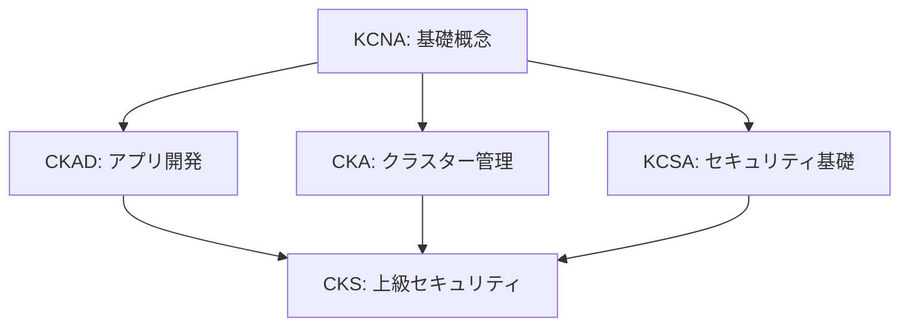

# Kubernetes 開発・運用ガイド

Kubernetes認定試験（KCNA〜CKS）に対応した包括的な学習・実践ガイド

## 📋 目次

### 🎯 [認定試験マップ](#認定試験マップ)
- [学習パス](#学習パス)
- [各認定レベルの概要](#各認定レベルの概要)

### 🚀 [環境セットアップ](#環境セットアップ)
- [WSL環境でのローカル開発](#wsl環境でのローカル開発)
  - [Minikube](#minikube) `KCNA`
  - [Kind (Kubernetes in Docker)](#kind-kubernetes-in-docker) `KCNA`
- [AWS EKS](#aws-eks) `CKA`

### ⚡ [クイックリファレンス](#クイックリファレンス)
- [頻出コマンド集](#頻出コマンド集)
- [YAML テンプレート](#yamlテンプレート)
- [試験対策チートシート](#試験対策チートシート)

### 🔧 [基本操作](#基本操作-kcnackadcka)
- [Pod操作](#pod操作) `KCNA` `CKAD`
- [Deployment](#deployment) `KCNA` `CKAD`
- [Service](#service) `KCNA` `CKAD`

### 🗃️ [設定管理](#設定管理)
- [ConfigMapとSecret](#configmapとsecret-ckacks) `CKA` `CKS`

### 🔐 [セキュリティ](#セキュリティ)
- [RBAC](#rbac-ckacks) `CKA` `CKS`
- [NetworkPolicy](#networkpolicy-cks) `CKS`
- [Pod Security Standards](#pod-security-standards) `CKS`
- [OPA Gatekeeper](#opa-gatekeeper) `CKS`
- [Falco](#falco) `CKS`

### 🚀 [CI/CD とデプロイメント](#cicd-とデプロイメント)
- [ArgoCD](#argocd) `CKAD` `CKA`
- [Kustomize](#kustomize) `CKAD`
- [Helm](#helm) `CKAD` `CKA`

### 🏗️ [高度な運用](#高度な運用)
- [Operator](#operator) `CKA`
- [Istio](#istio) `CKA`

### 📊 [監視・ログ](#監視ログ)
- [Prometheus + Grafana](#監視スタック-grafana--prometheus--loki--tempo) `CKA`
- [Loki](#loki) `CKA`
- [Tempo](#tempo) `CKA`
- [Thanos](#thanos) `CKA`

### 💾 [データ管理](#データ管理)
- [MinIO](#minio) `CKA`
- [Zalando Postgres Operator](#zalando-postgres-operator) `CKA`

### 📡 [メッセージング](#メッセージング)
- [NATS](#nats) `CKA`

### 🔧 [トラブルシューティング](#トラブルシューティング)
- [デバッグツール](#デバッグツール) `CKA` `CKS`
- [ログ収集](#ログ収集) `CKA`
- [パフォーマンスチューニング](#パフォーマンスチューニング) `CKA`

### 📚 [認定試験対策](#認定試験対策)
- [CKAD重要コマンド](#ckad重要コマンド)
- [CKA重要操作](#cka重要操作)
- [CKS重要設定](#cks重要設定)

---

## 認定試験マップ

### 学習パス



### 各認定レベルの概要

| 認定 | レベル | 対象者 | 主要スキル |
|------|--------|--------|------------|
| **KCNA** | 基礎 | 初心者 | Kubernetes基本概念、コンテナ、クラウドネイティブ |
| **KCSA** | 基礎 | セキュリティ初心者 | セキュリティ基礎、脅威モデル、防御戦略 |
| **CKAD** | 中級 | アプリ開発者 | アプリデプロイ、設定管理、トラブルシューティング |
| **CKA** | 中級〜上級 | システム管理者 | クラスター管理、ネットワーク、ストレージ、監視 |
| **CKS** | 上級 | セキュリティ専門家 | セキュリティ設定、脆弱性対策、コンプライアンス |

---

## クイックリファレンス

### 頻出コマンド集

#### 基本操作 `KCNA` `CKAD`
```bash
# 基本情報取得
kubectl cluster-info
kubectl get nodes
kubectl get pods --all-namespaces
kubectl get services

# リソース詳細確認
kubectl describe pod <pod-name>
kubectl logs <pod-name>
kubectl exec -it <pod-name> -- /bin/bash

# リソース作成・更新
kubectl apply -f <file.yaml>
kubectl create -f <file.yaml>
kubectl delete -f <file.yaml>
```

#### 運用操作 `CKA`
```bash
# ノード管理
kubectl drain <node-name> --ignore-daemonsets
kubectl uncordon <node-name>
kubectl top nodes

# スケーリング
kubectl scale deployment <name> --replicas=5
kubectl autoscale deployment <name> --min=2 --max=10 --cpu-percent=80

# ロールアウト
kubectl rollout status deployment/<name>
kubectl rollout history deployment/<name>
kubectl rollout undo deployment/<name>
```

#### セキュリティ `CKS`
```bash
# RBAC確認
kubectl auth can-i <verb> <resource> --as=<user>
kubectl get rolebindings,clusterrolebindings --all-namespaces

# セキュリティスキャン
kubectl get pods --all-namespaces -o jsonpath='{range .items[*]}{.metadata.namespace}{"\t"}{.metadata.name}{"\t"}{.spec.securityContext}{"\n"}{end}'
```

### YAMLテンプレート

#### 基本Pod `KCNA` `CKAD`
```yaml
apiVersion: v1
kind: Pod
metadata:
  name: example-pod
  labels:
    app: example
spec:
  containers:
  - name: app
    image: nginx:1.21
    ports:
    - containerPort: 80
    resources:
      requests:
        memory: "64Mi"
        cpu: "250m"
      limits:
        memory: "128Mi"
        cpu: "500m"
```

#### セキュアなPod `CKS`
```yaml
apiVersion: v1
kind: Pod
metadata:
  name: secure-pod
spec:
  securityContext:
    runAsNonRoot: true
    runAsUser: 1000
    fsGroup: 2000
  containers:
  - name: app
    image: nginx:1.21
    securityContext:
      allowPrivilegeEscalation: false
      readOnlyRootFilesystem: true
      capabilities:
        drop:
        - ALL
    volumeMounts:
    - name: tmp
      mountPath: /tmp
  volumes:
  - name: tmp
    emptyDir: {}
```

### 試験対策チートシート

#### 時間短縮テクニック `CKAD` `CKA` `CKS`
```bash
# エイリアス設定（試験開始時に実行）
alias k=kubectl
alias kgp='kubectl get pods'
alias kgs='kubectl get svc'
alias kgd='kubectl get deployment'
alias kdp='kubectl describe pod'
alias kaf='kubectl apply -f'
alias kdel='kubectl delete'

# 補完機能有効化
source <(kubectl completion bash)
complete -F __start_kubectl k

# 必須設定
export do="--dry-run=client -o yaml"
export now="--force --grace-period 0"
```

#### クイック作成コマンド `CKAD`
```bash
# Pod作成
k run nginx --image=nginx $do > pod.yaml

# Deployment作成
k create deploy webapp --image=nginx --replicas=3 $do > deploy.yaml

# Service作成
k expose deploy webapp --port=80 --target-port=8080 --type=ClusterIP $do > svc.yaml

# Job作成
k create job pi --image=perl -- perl -Mbignum=bpi -wle 'print bpi(2000)' $do > job.yaml

# CronJob作成
k create cj backup --image=busybox --schedule="0 2 * * *" -- /bin/sh -c 'echo backup' $do > cj.yaml

# ConfigMap作成
k create cm app-config --from-literal=key1=value1 --from-literal=key2=value2 $do > cm.yaml

# Secret作成
k create secret generic app-secret --from-literal=user=admin --from-literal=pass=secret $do > secret.yaml
```

#### 実用的なトラブルシューティング `CKA` `CKS`
```bash
# Podが起動しない場合の診断
k describe pod <pod-name>
k logs <pod-name> --previous
k get events --sort-by=.metadata.creationTimestamp

# ネットワーク疎通確認
k run test-pod --image=busybox:1.28 --rm -it -- nslookup kubernetes.default
k run test-pod --image=nicolaka/netshoot --rm -it -- /bin/bash

# リソース使用量確認
k top nodes
k top pods --all-namespaces
k describe node <node-name>

# ノード問題の診断
k get nodes -o wide
systemctl status kubelet
journalctl -u kubelet
```

---

## 環境セットアップ

### WSL環境でのローカル開発

#### Minikube `KCNA`

> **💡 ポイント**: ローカル開発環境として最も手軽なKubernetesクラスター

```bash
# Minikubeインストール
curl -LO https://storage.googleapis.com/minikube/releases/latest/minikube-linux-amd64
sudo install minikube-linux-amd64 /usr/local/bin/minikube

# クラスター起動
minikube start --cpus=4 --memory=8192 --driver=docker

# アドオン有効化
minikube addons enable ingress
minikube addons enable metrics-server
minikube addons enable dashboard

# 複数ノードクラスター
minikube start --nodes=3 --cpus=2 --memory=4096
```

#### Kind (Kubernetes in Docker) `KCNA`

> **💡 ポイント**: Dockerコンテナ内でKubernetesクラスターを実行、CI/CDに最適

```bash
# Kindインストール
curl -Lo ./kind https://kind.sigs.k8s.io/dl/v0.20.0/kind-linux-amd64
chmod +x ./kind
sudo mv ./kind /usr/local/bin/kind

# クラスター設定ファイル
cat <<EOF > kind-config.yaml
kind: Cluster
apiVersion: kind.x-k8s.io/v1alpha4
nodes:
- role: control-plane
  kubeadmConfigPatches:
  - |
    kind: InitConfiguration
    nodeRegistration:
      kubeletExtraArgs:
        node-labels: "ingress-ready=true"
  extraPortMappings:
  - containerPort: 80
    hostPort: 80
    protocol: TCP
  - containerPort: 443
    hostPort: 443
    protocol: TCP
- role: worker
- role: worker
EOF

# クラスター作成
kind create cluster --config kind-config.yaml --name dev-cluster
```

### AWS EKS `CKA`

> **💡 ポイント**: 本番環境向けマネージドKubernetesサービス

```bash
# eksctlインストール
curl --silent --location "https://github.com/weaveworks/eksctl/releases/latest/download/eksctl_$(uname -s)_amd64.tar.gz" | tar xz -C /tmp
sudo mv /tmp/eksctl /usr/local/bin

# EKSクラスター作成
eksctl create cluster \
  --name prod-cluster \
  --region ap-northeast-1 \
  --nodegroup-name standard-workers \
  --node-type t3.medium \
  --nodes 3 \
  --nodes-min 1 \
  --nodes-max 4 \
  --managed

# kubeconfig更新
aws eks update-kubeconfig --region ap-northeast-1 --name prod-cluster
```

## 基本操作（KCNA/CKAD/CKA）

### Pod操作 `KCNA` `CKAD`

> **📚 学習ポイント**
> - Podはデプロイ可能な最小単位
> - 1つのPodには通常1つのコンテナ
> - livenessProbeとreadinessProbeの違いを理解
> - リソース制限の重要性

```yaml
# pod-example.yaml
apiVersion: v1
kind: Pod
metadata:
  name: nginx-pod
  labels:
    app: nginx
spec:
  containers:
  - name: nginx
    image: nginx:1.21
    ports:
    - containerPort: 80
    resources:
      requests:
        memory: "64Mi"
        cpu: "250m"
      limits:
        memory: "128Mi"
        cpu: "500m"
    livenessProbe:
      httpGet:
        path: /
        port: 80
      initialDelaySeconds: 10
      periodSeconds: 5
    readinessProbe:
      httpGet:
        path: /
        port: 80
      initialDelaySeconds: 5
      periodSeconds: 3
```

```bash
# Pod作成・管理
kubectl apply -f pod-example.yaml
kubectl get pods -o wide
kubectl describe pod nginx-pod
kubectl logs nginx-pod
kubectl exec -it nginx-pod -- /bin/bash
kubectl port-forward nginx-pod 8080:80
```

### Deployment `KCNA` `CKAD`

> **📚 学習ポイント**
> - 宣言的なアプリケーション管理
> - ローリングアップデートとロールバック
> - レプリカ数の動的スケーリング
> - Pod選択時のlabelSelectorの活用

```yaml
# deployment.yaml
apiVersion: apps/v1
kind: Deployment
metadata:
  name: webapp
spec:
  replicas: 3
  selector:
    matchLabels:
      app: webapp
  template:
    metadata:
      labels:
        app: webapp
    spec:
      containers:
      - name: webapp
        image: webapp:v1.0
        ports:
        - containerPort: 8080
        env:
        - name: DATABASE_URL
          valueFrom:
            secretKeyRef:
              name: db-secret
              key: url
```

```bash
# デプロイメント操作
kubectl apply -f deployment.yaml
kubectl rollout status deployment/webapp
kubectl set image deployment/webapp webapp=webapp:v2.0
kubectl rollout history deployment/webapp
kubectl rollout undo deployment/webapp
```

### Service `KCNA` `CKAD`

> **📚 学習ポイント**
> - Pod間通信の抽象化レイヤー
> - ServiceタイプとEndpointsの関係
> - DNSベースのサービス検索
> - Ingressによる外部公開

```yaml
# service.yaml
apiVersion: v1
kind: Service
metadata:
  name: webapp-service
spec:
  selector:
    app: webapp
  type: ClusterIP
  ports:
  - port: 80
    targetPort: 8080
    protocol: TCP
---
apiVersion: networking.k8s.io/v1
kind: Ingress
metadata:
  name: webapp-ingress
  annotations:
    nginx.ingress.kubernetes.io/rewrite-target: /
spec:
  rules:
  - host: webapp.example.com
    http:
      paths:
      - path: /
        pathType: Prefix
        backend:
          service:
            name: webapp-service
            port:
              number: 80
```

---

## 設定管理

### ConfigMapとSecret `CKA` `CKS`

> **💡 ベストプラクティス**
> - Secretには機密情報のみを格納
> - ConfigMapは設定ファイルや環境変数に使用
> - Base64エンコードされたSecretも平文同様に扱う
> - 本番環境では外部シークレット管理ツール（Vault等）を検討

```bash
# ConfigMap作成
kubectl create configmap app-config \
  --from-literal=app.name=myapp \
  --from-literal=app.env=production \
  --from-file=config.properties

# Secret作成
kubectl create secret generic db-secret \
  --from-literal=username=dbuser \
  --from-literal=password='S3cur3P@ssw0rd'

# TLS Secret
kubectl create secret tls webapp-tls \
  --cert=path/to/tls.crt \
  --key=path/to/tls.key
```

```yaml
# secret-pod.yaml
apiVersion: v1
kind: Pod
metadata:
  name: secret-pod
spec:
  containers:
  - name: app
    image: busybox
    command: ['sh', '-c', 'echo $DB_PASSWORD && sleep 3600']
    env:
    - name: DB_PASSWORD
      valueFrom:
        secretKeyRef:
          name: db-secret
          key: password
    volumeMounts:
    - name: config
      mountPath: /etc/config
      readOnly: true
  volumes:
  - name: config
    configMap:
      name: app-config
```

---

## セキュリティ

### RBAC（Role-Based Access Control) `CKA` `CKS`

> **💡 ベストプラクティス**
> - 最小権限の原則を適用
> - サービスアカウント毎に適切な権限を設定
> - 定期的な権限監査を実施
> - ClusterRoleよりRoleを優先使用

```yaml
# rbac.yaml
apiVersion: v1
kind: ServiceAccount
metadata:
  name: app-sa
  namespace: default
---
apiVersion: rbac.authorization.k8s.io/v1
kind: Role
metadata:
  name: pod-reader
  namespace: default
rules:
- apiGroups: [""]
  resources: ["pods", "pods/log"]
  verbs: ["get", "list", "watch"]
---
apiVersion: rbac.authorization.k8s.io/v1
kind: RoleBinding
metadata:
  name: read-pods
  namespace: default
subjects:
- kind: ServiceAccount
  name: app-sa
  namespace: default
roleRef:
  kind: Role
  name: pod-reader
  apiGroup: rbac.authorization.k8s.io
```

### NetworkPolicy `CKS`

> **💡 ベストプラクティス**
> - デフォルト拒否ポリシーから開始
> - マイクロセグメンテーションを実装
> - 最小限の通信パスのみ許可
> - ラベルセレクタを効果的に活用

```yaml
# network-policy.yaml
apiVersion: networking.k8s.io/v1
kind: NetworkPolicy
metadata:
  name: webapp-netpol
spec:
  podSelector:
    matchLabels:
      app: webapp
  policyTypes:
  - Ingress
  - Egress
  ingress:
  - from:
    - namespaceSelector:
        matchLabels:
          name: frontend
    - podSelector:
        matchLabels:
          role: frontend
    ports:
    - protocol: TCP
      port: 8080
  egress:
  - to:
    - namespaceSelector:
        matchLabels:
          name: database
    ports:
    - protocol: TCP
      port: 5432
```

---

## CI/CD とデプロイメント

### ArgoCD `CKAD` `CKA`

> **💡 ベストプラクティス**
> - GitOpsワークフローの実装
> - アプリケーション設定のGit管理
> - 自動同期と手動承認の使い分け
> - 複数環境での段階的デプロイ

```bash
# ArgoCDインストール
kubectl create namespace argocd
kubectl apply -n argocd -f https://raw.githubusercontent.com/argoproj/argo-cd/stable/manifests/install.yaml

# ArgoCD CLI
curl -sSL -o argocd-linux-amd64 https://github.com/argoproj/argo-cd/releases/latest/download/argocd-linux-amd64
sudo install -m 555 argocd-linux-amd64 /usr/local/bin/argocd

# 初期パスワード取得
kubectl -n argocd get secret argocd-initial-admin-secret -o jsonpath="{.data.password}" | base64 -d

# ポートフォワード
kubectl port-forward svc/argocd-server -n argocd 8080:443
```

```yaml
# argocd-app.yaml
apiVersion: argoproj.io/v1alpha1
kind: Application
metadata:
  name: webapp
  namespace: argocd
spec:
  project: default
  source:
    repoURL: https://github.com/example/webapp
    targetRevision: HEAD
    path: k8s
  destination:
    server: https://kubernetes.default.svc
    namespace: default
  syncPolicy:
    automated:
      prune: true
      selfHeal: true
    syncOptions:
    - CreateNamespace=true
```

### Kustomize `CKAD`

> **💡 ベストプラクティス**
> - 環境別のオーバーレイ構成
> - 共通設定のbase使用
> - ConfigMapGeneratorで設定管理
> - イメージタグの環境別切り替え

```yaml
# base/kustomization.yaml
apiVersion: kustomize.config.k8s.io/v1beta1
kind: Kustomization

resources:
- deployment.yaml
- service.yaml
- configmap.yaml

commonLabels:
  app: webapp
  version: v1

configMapGenerator:
- name: app-config
  literals:
  - APP_ENV=production
  - LOG_LEVEL=info
```

```yaml
# overlays/production/kustomization.yaml
apiVersion: kustomize.config.k8s.io/v1beta1
kind: Kustomization

bases:
- ../../base

patchesStrategicMerge:
- deployment-patch.yaml

replicas:
- name: webapp
  count: 5

images:
- name: webapp
  newTag: v1.2.3
```

```bash
# Kustomize実行
kubectl apply -k overlays/production/
kubectl diff -k overlays/production/
```

### Helm `CKAD` `CKA`

> **💡 ベストプラクティス**
> - Values.yamlでの設定外部化
> - Helmテンプレートの適切な構造化
> - 依存関係の明確な管理
> - セキュリティスキャン（helm-secrets等）の導入

```bash
# Helmインストール
curl https://raw.githubusercontent.com/helm/helm/main/scripts/get-helm-3 | bash

# リポジトリ追加
helm repo add bitnami https://charts.bitnami.com/bitnami
helm repo add prometheus-community https://prometheus-community.github.io/helm-charts
helm repo update

# チャート検索・インストール
helm search repo nginx
helm install my-nginx bitnami/nginx
helm list
helm status my-nginx
```

```yaml
# Chart.yaml
apiVersion: v2
name: webapp
description: A Helm chart for webapp
type: application
version: 0.1.0
appVersion: "1.0"

# values.yaml
replicaCount: 3
image:
  repository: webapp
  pullPolicy: IfNotPresent
  tag: "v1.0"
service:
  type: ClusterIP
  port: 80
ingress:
  enabled: true
  className: "nginx"
  hosts:
    - host: webapp.example.com
      paths:
        - path: /
          pathType: ImplementationSpecific
resources:
  limits:
    cpu: 100m
    memory: 128Mi
  requests:
    cpu: 100m
    memory: 128Mi
```

---

## 高度な運用

### Operator `CKA`

> **💡 ベストプラクティス**
> - カスタムリソースの適切な設計
> - Controllerの冪等性確保
> - エラーハンドリングとリトライ戦略
> - 監視とアラートの実装

```bash
# Operator SDKインストール
curl -LO https://github.com/operator-framework/operator-sdk/releases/latest/download/operator-sdk_linux_amd64
chmod +x operator-sdk_linux_amd64
sudo mv operator-sdk_linux_amd64 /usr/local/bin/operator-sdk

# Operatorプロジェクト作成
operator-sdk init --domain example.com --repo github.com/example/webapp-operator
operator-sdk create api --group app --version v1alpha1 --kind WebApp --resource --controller
```

```go
// controllers/webapp_controller.go
func (r *WebAppReconciler) Reconcile(ctx context.Context, req ctrl.Request) (ctrl.Result, error) {
    log := r.Log.WithValues("webapp", req.NamespacedName)

    // WebAppリソース取得
    webapp := &appv1alpha1.WebApp{}
    if err := r.Get(ctx, req.NamespacedName, webapp); err != nil {
        return ctrl.Result{}, client.IgnoreNotFound(err)
    }

    // Deploymentの作成・更新
    deployment := r.deploymentForWebApp(webapp)
    if err := r.Create(ctx, deployment); err != nil && !errors.IsAlreadyExists(err) {
        return ctrl.Result{}, err
    }

    return ctrl.Result{}, nil
}
```

---

## 監視・ログ

### 監視スタック（Grafana + Prometheus + Loki + Tempo) `CKA`

> **💡 ベストプラクティス**
> - メトリクス、ログ、トレースの統合監視
> - 適切なアラートルールの設定
> - ダッシュボードの標準化
> - データ保持期間の最適化

### Prometheus Operator

```bash
# kube-prometheusインストール
git clone https://github.com/prometheus-operator/kube-prometheus.git
cd kube-prometheus
kubectl create -f manifests/setup
kubectl create -f manifests/
```

```yaml
# service-monitor.yaml
apiVersion: monitoring.coreos.com/v1
kind: ServiceMonitor
metadata:
  name: webapp-metrics
spec:
  selector:
    matchLabels:
      app: webapp
  endpoints:
  - port: metrics
    interval: 30s
    path: /metrics
```

### Grafana `CKA`

```yaml
# grafana-datasources.yaml
apiVersion: v1
kind: ConfigMap
metadata:
  name: grafana-datasources
data:
  datasources.yaml: |
    apiVersion: 1
    datasources:
    - name: Prometheus
      type: prometheus
      url: http://prometheus-k8s:9090
      access: proxy
      isDefault: true
    - name: Loki
      type: loki
      url: http://loki:3100
      access: proxy
    - name: Tempo
      type: tempo
      url: http://tempo:3100
      access: proxy
```

### Loki `CKA`

```bash
# Lokiインストール
helm repo add grafana https://grafana.github.io/helm-charts
helm install loki grafana/loki-stack \
  --set promtail.enabled=true \
  --set grafana.enabled=false
```

```yaml
# promtail-config.yaml
apiVersion: v1
kind: ConfigMap
metadata:
  name: promtail-config
data:
  promtail.yaml: |
    server:
      http_listen_port: 9080
    clients:
      - url: http://loki:3100/loki/api/v1/push
    scrape_configs:
    - job_name: kubernetes-pods
      kubernetes_sd_configs:
      - role: pod
      relabel_configs:
      - source_labels: [__meta_kubernetes_pod_label_app]
        target_label: app
      - source_labels: [__meta_kubernetes_namespace]
        target_label: namespace
```

### Tempo `CKA`

```yaml
# tempo-config.yaml
apiVersion: v1
kind: ConfigMap
metadata:
  name: tempo-config
data:
  tempo.yaml: |
    server:
      http_listen_port: 3100
    distributor:
      receivers:
        otlp:
          protocols:
            grpc:
              endpoint: 0.0.0.0:4317
            http:
              endpoint: 0.0.0.0:4318
    storage:
      trace:
        backend: s3
        s3:
          bucket: tempo-traces
          endpoint: minio:9000
          access_key: minioadmin
          secret_key: minioadmin
          insecure: true
```

---

## データ管理

### MinIO `CKA`

> **💡 ベストプラクティス**
> - S3互換のオブジェクトストレージとして活用
> - 分散ストレージによる高可用性確保
> - TLS通信と認証の設定
> - バックアップ戦略の実装

```bash
# MinIOインストール
helm repo add minio https://charts.min.io/
helm install minio minio/minio \
  --set accessKey=minioadmin \
  --set secretKey=minioadmin \
  --set persistence.size=10Gi
```

```yaml
# minio-tenant.yaml
apiVersion: minio.min.io/v2
kind: Tenant
metadata:
  name: minio-tenant
spec:
  image: minio/minio:RELEASE.2024-01-01T00-00-00Z
  pools:
  - servers: 4
    volumesPerServer: 4
    volumeClaimTemplate:
      metadata:
        name: data
      spec:
        accessModes:
          - ReadWriteOnce
        resources:
          requests:
            storage: 10Gi
```

### Zalando Postgres Operator `CKA`

> **💡 ベストプラクティス**
> - 高可用性PostgreSQLクラスターの自動化
> - バックアップとリストアの自動化
> - パフォーマンス監視の実装
> - セキュリティ設定の強化

```bash
# Zalando Postgres Operatorインストール
kubectl create namespace postgres-operator
helm repo add postgres-operator-charts https://opensource.zalando.com/postgres-operator/charts/postgres-operator
helm install postgres-operator postgres-operator-charts/postgres-operator -n postgres-operator
```

```yaml
# postgres-cluster.yaml
apiVersion: acid.zalan.do/v1
kind: postgresql
metadata:
  name: webapp-db
spec:
  teamId: "webapp"
  volume:
    size: 10Gi
  numberOfInstances: 3
  users:
    webapp:
    - superuser
    - createdb
  databases:
    webapp: webapp
  postgresql:
    version: "14"
  resources:
    requests:
      cpu: 100m
      memory: 100Mi
    limits:
      cpu: 500m
      memory: 500Mi
```

### Thanos `CKA`

> **💡 ベストプラクティス**
> - 長期メトリクス保存戦略
> - 複数Prometheusインスタンスの統合
> - オブジェクトストレージの活用
> - グローバルビューの提供

```yaml
# thanos-sidecar.yaml
apiVersion: v1
kind: Service
metadata:
  name: thanos-sidecar
spec:
  type: ClusterIP
  clusterIP: None
  ports:
  - name: grpc
    port: 10901
    targetPort: grpc
  - name: http
    port: 10902
    targetPort: http
  selector:
    app: prometheus
---
apiVersion: apps/v1
kind: StatefulSet
metadata:
  name: thanos-store
spec:
  serviceName: thanos-store
  replicas: 1
  selector:
    matchLabels:
      app: thanos-store
  template:
    metadata:
      labels:
        app: thanos-store
    spec:
      containers:
      - name: thanos-store
        image: quay.io/thanos/thanos:v0.32.0
        args:
        - store
        - --data-dir=/data
        - --objstore.config-file=/etc/thanos/objstore.yaml
        volumeMounts:
        - name: data
          mountPath: /data
        - name: objstore-config
          mountPath: /etc/thanos
```

---

## メッセージング

### NATS `CKA`

> **💡 ベストプラクティス**
> - JetStreamによる永続化メッセージング
> - 高性能・低レイテンシな通信
> - マイクロサービス間の疎結合化
> - セキュアな認証・認可の実装

```bash
# NATSインストール
helm repo add nats https://nats-io.github.io/k8s/helm/charts/
helm install nats nats/nats \
  --set cluster.enabled=true \
  --set cluster.replicas=3
```

```yaml
# nats-jetstream.yaml
apiVersion: v1
kind: ConfigMap
metadata:
  name: nats-config
data:
  nats.conf: |
    port: 4222
    http: 8222
    
    jetstream {
      store_dir: /data/jetstream
      max_memory_store: 1Gb
      max_file_store: 10Gb
    }
    
    cluster {
      name: nats-cluster
      port: 6222
      routes: [
        nats://nats-0.nats:6222
        nats://nats-1.nats:6222
        nats://nats-2.nats:6222
      ]
    }
```

### Istio `CKA`

> **💡 ベストプラクティス**
> - サービスメッシュによる通信制御
> - mTLSによるセキュアな通信
> - トラフィック管理とカナリアデプロイ
> - 分散トレーシングの活用

```bash
# Istioインストール
curl -L https://istio.io/downloadIstio | sh -
cd istio-*
export PATH=$PWD/bin:$PATH
istioctl install --set profile=demo -y
kubectl label namespace default istio-injection=enabled
```

```yaml
# istio-gateway.yaml
apiVersion: networking.istio.io/v1beta1
kind: Gateway
metadata:
  name: webapp-gateway
spec:
  selector:
    istio: ingressgateway
  servers:
  - port:
      number: 80
      name: http
      protocol: HTTP
    hosts:
    - "webapp.example.com"
---
apiVersion: networking.istio.io/v1beta1
kind: VirtualService
metadata:
  name: webapp
spec:
  hosts:
  - "webapp.example.com"
  gateways:
  - webapp-gateway
  http:
  - match:
    - uri:
        prefix: "/"
    route:
    - destination:
        host: webapp-service
        port:
          number: 80
      weight: 100
```

```yaml
# istio-traffic-management.yaml
apiVersion: networking.istio.io/v1beta1
kind: DestinationRule
metadata:
  name: webapp-destination
spec:
  host: webapp-service
  trafficPolicy:
    connectionPool:
      tcp:
        maxConnections: 100
      http:
        http1MaxPendingRequests: 10
        http2MaxRequests: 100
    loadBalancer:
      simple: ROUND_ROBIN
    outlierDetection:
      consecutiveErrors: 5
      interval: 30s
      baseEjectionTime: 30s
  subsets:
  - name: v1
    labels:
      version: v1
  - name: v2
    labels:
      version: v2
```

### Pod Security Standards `CKS`

> **💡 ベストプラクティス**
> - Restrictedプロファイルの使用を推奨
> - 特権コンテナの使用禁止
> - 読み取り専用ルートファイルシステム
> - 非rootユーザーでの実行

```yaml
# pod-security-policy.yaml
apiVersion: policy/v1beta1
kind: PodSecurityPolicy
metadata:
  name: restricted
spec:
  privileged: false
  allowPrivilegeEscalation: false
  requiredDropCapabilities:
    - ALL
  volumes:
    - 'configMap'
    - 'emptyDir'
    - 'projected'
    - 'secret'
    - 'downwardAPI'
    - 'persistentVolumeClaim'
  hostNetwork: false
  hostIPC: false
  hostPID: false
  runAsUser:
    rule: 'MustRunAsNonRoot'
  seLinux:
    rule: 'RunAsAny'
  fsGroup:
    rule: 'RunAsAny'
  readOnlyRootFilesystem: false
```

### OPA Gatekeeper `CKS`

> **💡 ベストプラクティス**
> - ポリシーのコード化によるガバナンス
> - 段階的なポリシー導入（warn→enforce）
> - 包括的なConstraintTemplateの作成
> - 継続的なポリシー監査

```bash
# Gatekeeperインストール
kubectl apply -f https://raw.githubusercontent.com/open-policy-agent/gatekeeper/release-3.14/deploy/gatekeeper.yaml
```

```yaml
# gatekeeper-constraint.yaml
apiVersion: templates.gatekeeper.sh/v1beta1
kind: ConstraintTemplate
metadata:
  name: k8srequiredlabels
spec:
  crd:
    spec:
      names:
        kind: K8sRequiredLabels
      validation:
        openAPIV3Schema:
          type: object
          properties:
            labels:
              type: array
              items:
                type: string
  targets:
    - target: admission.k8s.gatekeeper.sh
      rego: |
        package k8srequiredlabels
        
        violation[{"msg": msg}] {
          required := input.parameters.labels
          provided := input.review.object.metadata.labels
          missing := required[_]
          not provided[missing]
          msg := sprintf("Label '%v' is required", [missing])
        }
```

### Falco `CKS`

> **💡 ベストプラクティス**
> - リアルタイムセキュリティ監視
> - カスタムルールによる脅威検出
> - アラート通知の自動化
> - ログ分析との連携

```bash
# Falcoインストール
helm repo add falcosecurity https://falcosecurity.github.io/charts
helm install falco falcosecurity/falco \
  --set driver.kind=ebpf \
  --set falco.grpc.enabled=true \
  --set falco.grpcOutput.enabled=true
```

```yaml
# falco-rules.yaml
- rule: Unauthorized Process in Container
  desc: Detect unauthorized process running in container
  condition: >
    spawned_process and container and not proc.name in (allowed_processes)
  output: >
    Unauthorized process started in container 
    (user=%user.name command=%proc.cmdline container_id=%container.id image=%container.image.repository)
  priority: WARNING
  tags: [container, process]
```

---

## トラブルシューティング

### デバッグツール `CKA` `CKS`

> **💡 ベストプラクティス**
> - 段階的なアプローチで問題を特定
> - ログとイベントの systematic な確認
> - ネットワークとDNSの動作確認
> - リソース使用量の継続的監視

```bash
# デバッグPod作成
kubectl run debug-pod --image=nicolaka/netshoot:latest --rm -it -- /bin/bash

# Node調査
kubectl debug node/node-name -it --image=ubuntu

# Podデバッグ
kubectl debug webapp-pod -it --image=busybox --share-processes --copy-to=webapp-debug

# リソース使用状況
kubectl top nodes
kubectl top pods --all-namespaces
```

### ログ収集 `CKA`

> **📚 学習ポイント**
> - アプリケーション・システム・監査ログの区別
> - 構造化ログの活用
> - 集約型ログ管理の導入
> - ログローテーションの重要性

```bash
# ログ確認
kubectl logs -f deployment/webapp --all-containers=true --tail=100
kubectl logs -f pod/webapp-xxx --previous

# イベント確認
kubectl get events --sort-by=.metadata.creationTimestamp
kubectl describe pod webapp-xxx
```

### パフォーマンスチューニング `CKA`

> **📚 学習ポイント**
> - リソース要求と制限の適切な設定
> - HPA/VPAによる自動スケーリング
> - ノードアフィニティとTaintの活用
> - PodDisruptionBudgetによる可用性確保

```yaml
# hpa.yaml
apiVersion: autoscaling/v2
kind: HorizontalPodAutoscaler
metadata:
  name: webapp-hpa
spec:
  scaleTargetRef:
    apiVersion: apps/v1
    kind: Deployment
    name: webapp
  minReplicas: 3
  maxReplicas: 10
  metrics:
  - type: Resource
    resource:
      name: cpu
      target:
        type: Utilization
        averageUtilization: 70
  - type: Resource
    resource:
      name: memory
      target:
        type: AverageValue
        averageValue: "200Mi"
  behavior:
    scaleDown:
      stabilizationWindowSeconds: 300
      policies:
      - type: Percent
        value: 10
        periodSeconds: 60
    scaleUp:
      stabilizationWindowSeconds: 0
      policies:
      - type: Percent
        value: 100
        periodSeconds: 30
```

---

## 認定試験対策

### CKAD重要コマンド

> **⏰ 試験時間**: 2時間
> **📝 問題数**: 15-20問
> **💻 実技**: ハンズオン形式
> **📚 重点分野**: アプリケーション設計・構築・設定・デプロイ

```bash
# Pod作成（ドライラン）
kubectl run nginx --image=nginx --dry-run=client -o yaml > pod.yaml

# Deployment作成
kubectl create deployment webapp --image=nginx --replicas=3 --dry-run=client -o yaml > deployment.yaml

# Service公開
kubectl expose deployment webapp --port=80 --target-port=8080 --type=ClusterIP

# ConfigMap作成
kubectl create configmap app-config --from-literal=key1=value1 --from-file=app.properties

# Job作成
kubectl create job backup --image=busybox -- /bin/sh -c "echo backup"

# CronJob作成
kubectl create cronjob backup --image=busybox --schedule="0 1 * * *" -- /bin/sh -c "echo backup"
```

### CKA重要操作

> **⏰ 試験時間**: 3時間
> **📝 問題数**: 15-20問
> **💻 実技**: クラスター管理・ネットワーク・ストレージ
> **📚 重点分野**: クラスター管理・ワークロード・サービス・ネットワーク

```bash
# etcdバックアップ
ETCDCTL_API=3 etcdctl snapshot save snapshot.db \
  --endpoints=https://127.0.0.1:2379 \
  --cacert=/etc/kubernetes/pki/etcd/ca.crt \
  --cert=/etc/kubernetes/pki/etcd/server.crt \
  --key=/etc/kubernetes/pki/etcd/server.key

# クラスターアップグレード
kubeadm upgrade plan
kubeadm upgrade apply v1.28.0

# ノードドレイン
kubectl drain node-name --ignore-daemonsets --delete-emptydir-data
kubectl uncordon node-name

# 証明書更新
kubeadm certs check-expiration
kubeadm certs renew all
```

### CKS重要設定

> **⏰ 試験時間**: 2時間
> **📝 問題数**: 15-20問
> **💻 実技**: セキュリティ設定・脆弱性対策・コンプライアンス
> **📚 重点分野**: クラスター設定・システム強化・監視・ログ・ランタイムセキュリティ

```bash
# Admission Controller有効化
kube-apiserver \
  --enable-admission-plugins=PodSecurityPolicy,ResourceQuota,LimitRanger \
  --disable-admission-plugins=AlwaysPullImages

# 監査ログ設定
kube-apiserver \
  --audit-log-path=/var/log/kubernetes/audit.log \
  --audit-log-maxage=30 \
  --audit-log-maxbackup=10 \
  --audit-log-maxsize=100

# kubeletセキュリティ設定
kubelet \
  --anonymous-auth=false \
  --authorization-mode=Webhook \
  --client-ca-file=/etc/kubernetes/pki/ca.crt
```